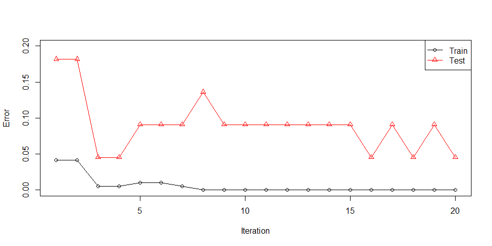
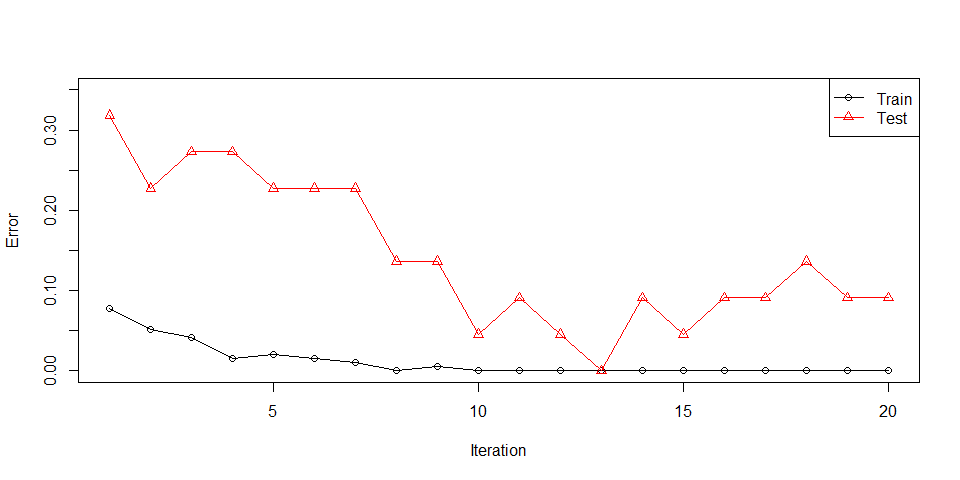
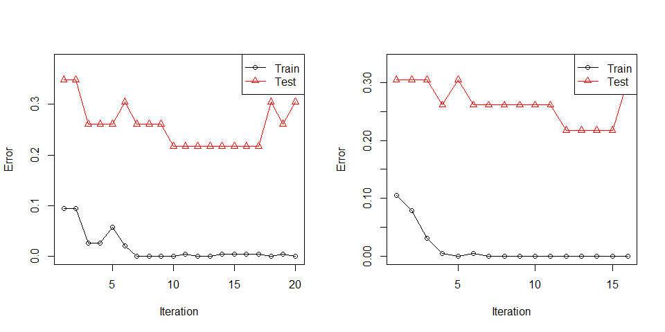
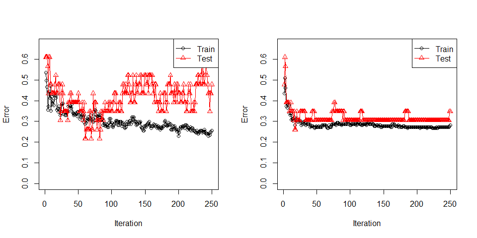
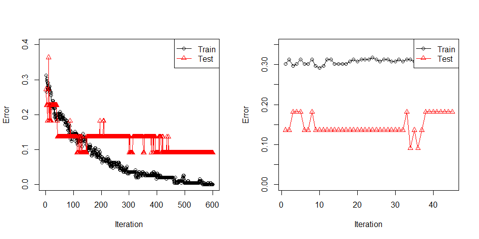

# Introduction

This package aims to enable the use of classifiers in boosting family
algorithms, apart from decision trees and other classical weak
classifiers. The current scope of the package includes Real AdaBoost and
Discrete AdaBoost, as well as multiclass versions of these methods, the
SAMME and SAMME.R algorithms.

## Future plans

I am aware that there have been attempts to create frameworks that allow
using custom functions in boosting (e.g. boostr). However, they are too
complex to my taste. I haven’t seen a simple-to-use package that handles
different boosting methods. What can be done simply in Python, why can’t
it be done in R? That is my point. The package is still in the starting
phase (a baby package). Things on my mind:

-   I will add more boosting algorithms such as GentleBoost, LogitBoost,
    Gradient Boosting and XGBoost.
-   I will enable the establishment of not only classification but also
    regression models with these methods.
-   In accordance with the main purpose of the package, I will allow the
    use of regression models prepared by the user in boosting
    algorithms.
-   Custom resampling methods to use in each boosting step for class
    imbalanced datasets and some pre-ready methods such as
    random-undersampling, random-oversampling and SMOTE.
-   Data pre-processing methods (e.g. PCA, KPCA, discretization,
    dummyfication).
-   Missing data handling methods (e.g. list-wise deletion, row-wise
    deletion, data imputation)
-   If I can, I will add a generalizable feature importance function for
    all weak classifier (or regression) methods. I’m not sure it can be
    done. I will work on this issue. I am open to any advice on this
    matter.
-   I will prepare a shiny app inside the package, which you can upload
    your own data and use any functions available. Varying
    visualizations and performance metrics will be available. And you
    will be able to add your custom function using the app.
-   I can add the bagging algorithms after all the plans are complete.
    But I can’t say I’m very keen on this, since it is just model
    averaging with bootstrapped models. I am not a fan of bagging.

# `booster` function

There is a function for each method in the package. But the main
function is the `booster`. By using this function it will be possible to
access everything. Let me give you information about the features of
this function and how to use it. First of all, 2 different AdaBoost
methods can be applied with the `booster` function: Real AdaBoost and
Discrete AdaBoost. Let us use glass0 dataset in `imbalance` package and
prepare a train and test dataset. test dataset is not mandatory.

``` r
library(rbooster)
cv_sampler <- function(y, train_proportion) {
  unlist(lapply(unique(y), function(m) sample(which(y==m), round(sum(y==m))*train_proportion)))
}

library(imbalance)
data <- glass0
p <- ncol(data) - 1

x <- data[,1:p]
y <- data[, p + 1]

train_i <- cv_sampler(y, 0.9)
x_train <- x[train_i,]
y_train <- y[train_i]

x_test <- x[-train_i,]
y_test <- y[-train_i]
```

This is a two-class dataset. Let us use decision tree to build Discrete
and Real AdaBoost models.

``` r
m_discrete <- booster(x_train = x_train, 
        y_train = y_train, 
        classifier = "rpart", 
        method = "discrete",
        x_test = x_test,
        y_test = y_test, 
        weighted_bootstrap = FALSE,
        max_iter = 20, 
        lambda = 1, 
        print_detail = TRUE, 
        print_plot = TRUE, 
        bag_frac = 0.8, 
        p_weak = 4)
#> 1 Train err:0.04167, Test err:0.18182, Weighted err:0.04167
#> 2 Train err:0.04167, Test err:0.18182, Weighted err:0.07195
#> 3 Train err:0.00521, Test err:0.04545, Weighted err:0.04014
#> 4 Train err:0.00521, Test err:0.04545, Weighted err:0.11524
#> 5 Train err:0.01042, Test err:0.09091, Weighted err:0.07580
#> 6 Train err:0.01042, Test err:0.09091, Weighted err:0.13923
#> 7 Train err:0.00521, Test err:0.09091, Weighted err:0.08863
#> 8 Train err:0.00000, Test err:0.13636, Weighted err:0.05526
#> 9 Train err:0.00000, Test err:0.09091, Weighted err:0.06539
#> 10 Train err:0.00000, Test err:0.09091, Weighted err:0.18110
#> 11 Train err:0.00000, Test err:0.09091, Weighted err:0.12768
#> 12 Train err:0.00000, Test err:0.09091, Weighted err:0.24721
#> 13 Train err:0.00000, Test err:0.09091, Weighted err:0.06630
#> 14 Train err:0.00000, Test err:0.09091, Weighted err:0.10293
#> 15 Train err:0.00000, Test err:0.09091, Weighted err:0.07404
#> 16 Train err:0.00000, Test err:0.04545, Weighted err:0.08221
#> 17 Train err:0.00000, Test err:0.09091, Weighted err:0.12928
#> 18 Train err:0.00000, Test err:0.04545, Weighted err:0.14301
#> 19 Train err:0.00000, Test err:0.09091, Weighted err:0.13722
#> 20 Train err:0.00000, Test err:0.04545, Weighted err:0.08173
```



``` r
m_real <- booster(x_train = x_train, 
                      y_train = y_train, 
                      classifier = "rpart", 
                      method = "real",
                      x_test = x_test,
                      y_test = y_test, 
                      weighted_bootstrap = FALSE,
                      max_iter = 20, 
                      lambda = 1, 
                      print_detail = TRUE, 
                      print_plot = TRUE, 
                      bag_frac = 0.8, 
                      p_weak = 4)
#> 1 Train err:0.07812, Test err:0.31818, Weighted err:0.07812
#> 2 Train err:0.05208, Test err:0.22727, Weighted err:0.01914
#> 3 Train err:0.04167, Test err:0.27273, Weighted err:0.07696
#> 4 Train err:0.01562, Test err:0.27273, Weighted err:0.26836
#> 5 Train err:0.02083, Test err:0.22727, Weighted err:0.02338
#> 6 Train err:0.01562, Test err:0.22727, Weighted err:0.46096
#> 7 Train err:0.01042, Test err:0.22727, Weighted err:0.02315
#> 8 Train err:0.00000, Test err:0.13636, Weighted err:0.02416
#> 9 Train err:0.00521, Test err:0.13636, Weighted err:0.13217
#> 10 Train err:0.00000, Test err:0.04545, Weighted err:0.10323
#> 11 Train err:0.00000, Test err:0.09091, Weighted err:0.05400
#> 12 Train err:0.00000, Test err:0.04545, Weighted err:0.12940
#> 13 Train err:0.00000, Test err:0.00000, Weighted err:0.07897
#> 14 Train err:0.00000, Test err:0.09091, Weighted err:0.09409
#> 15 Train err:0.00000, Test err:0.04545, Weighted err:0.19163
#> 16 Train err:0.00000, Test err:0.09091, Weighted err:0.00126
#> 17 Train err:0.00000, Test err:0.09091, Weighted err:0.11718
#> 18 Train err:0.00000, Test err:0.13636, Weighted err:0.02881
#> 19 Train err:0.00000, Test err:0.09091, Weighted err:0.15983
#> 20 Train err:0.00000, Test err:0.09091, Weighted err:0.15628
```



We can obtain predictions on `x_test` like:

``` r
head(m_discrete$test_prediction)
#> [1] "positive" "positive" "positive" "positive" "positive" "positive"
head(m_real$test_prediction)
#> [1] "positive" "positive" "positive" "positive" "positive" "positive"

table(y_test, m_discrete$test_prediction)
#>           
#> y_test     negative positive
#>   negative       14        1
#>   positive        0        7
table(y_test, m_real$test_prediction)
#>           
#> y_test     negative positive
#>   negative       13        2
#>   positive        0        7
```

However `x_test` is used to validate on `y_test`. So without `y_test`,
`x_test` is ignored. `x_test` and `y_test` can be set to `NULL`, they
are not mandatory for model to be established. You can use the usual
`predict` function.

``` r
pred_discrete <- predict(object = m_discrete, newdata = x_test, type = "pred")
pred_real <- predict(object = m_real, newdata = x_test, type = "pred")

all(pred_discrete == m_discrete$test_prediction)
#> [1] TRUE
all(pred_discrete == m_discrete$test_prediction)
#> [1] TRUE
```

In `predict` function `type` can be “pred” or “prob”. “prob” will gives
class probability matrix.

``` r
prob_discrete <- predict(object = m_discrete, newdata = x_test, type = "prob")
head(prob_discrete)
#>          negative  positive
#> [1,] 2.808763e-02 0.9719124
#> [2,] 1.922510e-02 0.9807749
#> [3,] 2.669226e-01 0.7330774
#> [4,] 1.115012e-09 1.0000000
#> [5,] 6.798746e-06 0.9999932
#> [6,] 1.947661e-03 0.9980523
```

Let us use Glass dataset in mlbench for multiclass classification
example.

``` r
library(mlbench)
data(Glass)
data <- Glass
p <- ncol(data) - 1

x <- data[,1:p]
y <- data[, p + 1]

train_i <- cv_sampler(y, 0.9)
x_train <- x[train_i,]
y_train <- y[train_i]

x_test <- x[-train_i,]
y_test <- y[-train_i]


par(mfrow = c(1,2))
m_discrete <- booster(x_train = x_train, 
                      y_train = y_train, 
                      classifier = "rpart", 
                      method = "discrete",
                      x_test = x_test,
                      y_test = y_test, 
                      weighted_bootstrap = FALSE,
                      max_iter = 20, 
                      lambda = 1, 
                      print_detail = FALSE, 
                      print_plot = TRUE, 
                      bag_frac = 0.8, 
                      p_weak = p)

m_real <- booster(x_train = x_train, 
                  y_train = y_train, 
                  classifier = "rpart", 
                  method = "real",
                  x_test = x_test,
                  y_test = y_test, 
                  weighted_bootstrap = FALSE,
                  max_iter = 20, 
                  lambda = 0.1, 
                  print_detail = FALSE, 
                  print_plot = TRUE, 
                  bag_frac = 1, 
                  p_weak = p)
#> Warning in bb(x_train = x_train, y_train = y_train, classifier = classifier, :
#> Learning stopped at iteration 16
```



``` r
invisible(dev.off())
pred_discrete <- predict(object = m_discrete, newdata = x_test, type = "pred")
pred_real <- predict(object = m_real, newdata = x_test, type = "pred")

table(y_test, pred_discrete)
#>       pred_discrete
#> y_test 1 2 3 5 6 7
#>      1 6 1 0 0 0 0
#>      2 3 4 1 0 0 0
#>      3 1 0 1 0 0 0
#>      5 0 0 0 1 0 1
#>      6 0 0 0 0 1 0
#>      7 0 0 0 0 0 3
table(y_test, pred_real)
#>       pred_real
#> y_test 1 2 3 5 6 7
#>      1 7 0 0 0 0 0
#>      2 2 4 2 0 0 0
#>      3 2 0 0 0 0 0
#>      5 0 0 0 1 0 1
#>      6 0 0 0 0 1 0
#>      7 0 0 0 0 0 3
```

There is a major reason people use decision trees in boosting. It fits
very quick. Let us try a pre-ready classifier Discrete Naive Bayes,
“dnb”, in `rbooster`.

``` r
par(mfrow = c(1,2))
m_discrete <- booster(x_train = x_train, 
                      y_train = y_train, 
                      classifier = "dnb", 
                      method = "discrete",
                      x_test = x_test,
                      y_test = y_test, 
                      weighted_bootstrap = FALSE,
                      max_iter = 250, 
                      lambda = 1, 
                      print_detail = FALSE, 
                      print_plot = TRUE, 
                      bag_frac = 0.5, 
                      p_weak = 4)

m_real <- booster(x_train = x_train, 
                  y_train = y_train, 
                  classifier = "dnb", 
                  method = "real",
                  x_test = x_test,
                  y_test = y_test, 
                  weighted_bootstrap = FALSE,
                  max_iter = 250, 
                  lambda = 1e-4, 
                  print_detail = FALSE, 
                  print_plot = TRUE, 
                  bag_frac = 0.2, 
                  p_weak = 4)
```



``` r
invisible(dev.off())
pred_discrete <- predict(object = m_discrete, newdata = x_test, type = "pred")
pred_real <- predict(object = m_real, newdata = x_test, type = "pred")

table(y_test, pred_discrete)
#>       pred_discrete
#> y_test 1 2 3 5 6 7
#>      1 2 2 3 0 0 0
#>      2 2 5 0 0 0 1
#>      3 1 1 0 0 0 0
#>      5 0 0 0 1 0 1
#>      6 0 0 0 0 1 0
#>      7 0 0 0 0 0 3
table(y_test, pred_real)
#>       pred_real
#> y_test 1 2 3 5 6 7
#>      1 6 1 0 0 0 0
#>      2 4 4 0 0 0 0
#>      3 2 0 0 0 0 0
#>      5 0 0 0 1 0 1
#>      6 0 0 0 0 1 0
#>      7 0 0 0 0 0 3
```

I needed to play with lambda, bag\_frac and p\_weak a lot to find a good
setting so that “dnb” fits. It is still not quite successful. Methods
other that decision trees require care.

## Custom Classifier

Classifier function requires x\_train, y\_train, weights as mandatory.
Output of Classifier function will be the input for Predictor function.
Predictor function requires model, which is the output of Classifier,
x\_new, which is the train features, and type inputs. type can only be
“pred” or “prob”. “pred” must give a class vector of predictions, and
“prob” must give a matrix of class probabilities. “pred” is mandatory
for both Real and Discrete AdaBoost. However, Discrete AdaBoost does not
require type “prob”. Let me prepare a made up Classifier function.

``` r
classifier_lm <- function(x_train, y_train, weights, ...){
  y_train_code <- c(-1,1)
  y_train_coded <- sapply(levels(y_train), function(m) y_train_code[(y_train == m) + 1])
  y_train_coded <- y_train_coded[,1]
  if (is.null(weights)) {
    weights <- rep(1, length(y_train))
  }
  
  model <- lm.wfit(x = as.matrix(cbind(1,x_train)), y = y_train_coded, w = weights)
  return(list(coefficients = model$coefficients,
              levels = levels(y_train)))
}

predictor_lm <- function(model, x_new, type = "pred", ...) {
  coef <- model$coefficients
  levels <- model$levels
  
  fit <- as.matrix(cbind(1, x_new))%*%coef
  probs <- 1/(1 + exp(-fit))
  probs <- data.frame(probs, 1 - probs)
  colnames(probs) <- levels
  
  if (type == "pred") {
    preds <- factor(levels[apply(probs, 1, which.max)], levels = levels, labels = levels)
    return(preds)
  }
  if (type == "prob") {
    return(probs)
  }
}
```

This classifier will convert y\_train into (-1,1) codes and predictions
will be transformed into the range (0,1) using logit transformation.
These values will be used as probabilities and class with the higher
probabilitiy will be selected as prediction. Since this is a linear
classification method, it should work well with boosting. Let us see.

``` r
data <- glass0
p <- ncol(data) - 1

x <- data[,1:p]
y <- data[, p + 1]

train_i <- cv_sampler(y, 0.9)
x_train <- x[train_i,]
y_train <- y[train_i]

x_test <- x[-train_i,]
y_test <- y[-train_i]

par(mfrow = c(1,2))
m_discrete <- booster(x_train = x_train, 
                      y_train = y_train, 
                      classifier = classifier_lm,
                      predictor = predictor_lm,
                      method = "discrete",
                      x_test = x_test,
                      y_test = y_test, 
                      weighted_bootstrap = FALSE,
                      max_iter = 600, 
                      lambda = 2, 
                      print_detail = FALSE, 
                      print_plot = TRUE, 
                      bag_frac = 0.4, 
                      p_weak = 4)

m_real <- booster(x_train = x_train, 
                  y_train = y_train, 
                  classifier = classifier_lm,
                  predictor = predictor_lm,
                  method = "real",
                  x_test = x_test,
                  y_test = y_test, 
                  weighted_bootstrap = FALSE,
                  max_iter = 200, 
                  lambda = 0.1, 
                  print_detail = FALSE, 
                  print_plot = TRUE, 
                  bag_frac = 1, 
                  p_weak = 4)
#> Warning in bb(x_train = x_train, y_train = y_train, classifier = classifier, :
#> Learning stopped at iteration 45
```


``` r
invisible(dev.off())
pred_discrete <- predict(object = m_discrete, newdata = x_test, type = "pred")
pred_real <- predict(object = m_real, newdata = x_test, type = "pred")

table(y_test, pred_discrete)
#>           pred_discrete
#> y_test     negative positive
#>   negative       14        1
#>   positive        1        6
table(y_test, pred_real)
#>           pred_real
#> y_test     negative positive
#>   negative       13        2
#>   positive        2        5
```

It fits but not quite there. `print_plot` can be set to `FALSE`. In that
case, the same plot can be generated using `plot` function.

``` r
par(mfrow = c(1,2))
plot(m_discrete)
plot(m_real)
```



``` r
invisible(dev.off())
```

Pre-ready weak classifiers are “rpart”, “gnb”, “dnb”, “earth” and “glm”
which are CART, Gaussian Naive Bayes, Discrete Naive Bayes, Multivariate
Adaptive Regression Splines from earth package and logistic regression
respectively. “glm” is not capable of multiclass classification. booster
object can be used with prediction, plot, and print functions. For other
details about booster object and its outputs, please see help document.
